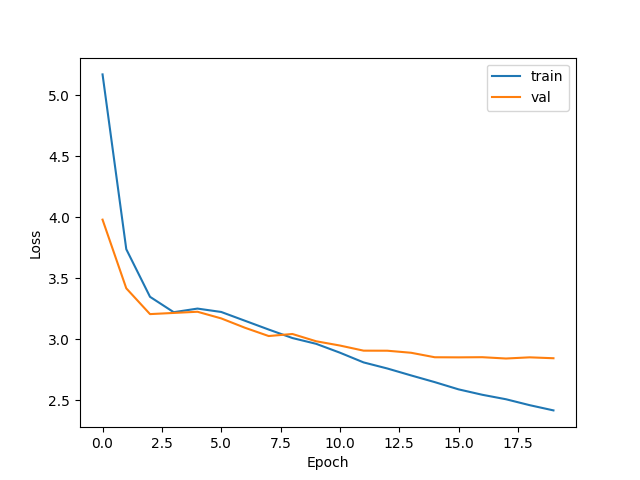
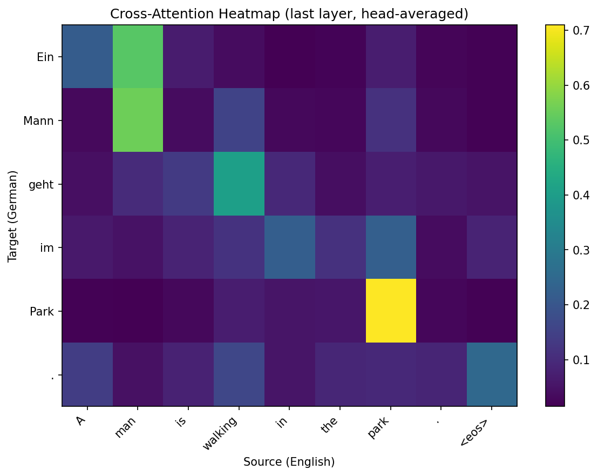

# Tiny Transformer: Attention Is All You Need (from scratch)

A from-scratch PyTorch implementation of the Transformer architecture
(Vaswani et al., 2017), trained on Multi30k for English–German translation.

## Motivation

Educational paper-faithful replication. No pretrained components, no copy-pasted
reference code. Every architectural decision and training detail follows the
original paper as closely as possible. Built to deeply understand the
mechanisms of attention, encoder-decoder structure, and Transformer training
dynamics.

## Architecture

- 6 encoder + 6 decoder layers
- d_model = 512, num_heads = 8, d_ff = 2048
- Sinusoidal positional encoding (non-learned)
- Post-LN (paper original, not Pre-LN)
- ~46M parameters

## Training Details

- Dataset: Multi30k (29k EN-DE sentence pairs)
- Tokenization: spaCy (en_core_web_sm, de_core_news_sm)
- Vocabulary: word-level, min frequency 2
- Optimizer: Adam (β₁=0.9, β₂=0.98, ε=1e-9)
- LR Schedule: Noam (warmup_steps=4000)
- Label smoothing: 0.1
- Gradient clipping: max_norm=1.0
- Batch size: 32
- Epochs: 20 (~6.5 min/epoch on RTX 3050 ti Laptop)
- Total training time: ~2.5 hours

## Results

| Metric | Value |
|--------|-------|
| Train loss (epoch 20) | 2.42 |
| Val loss (best, epoch 18) | 2.84 |
| Test BLEU (sacrebleu) | 22.38 |

Note: BLEU score may be slightly inflated due to spaCy pre-tokenization
of input to sacrebleu. True detokenized BLEU likely 20–21.

### Loss Curve



### Cross-Attention Visualization



Cross-attention from the last decoder layer (averaged across 8 heads) for
the input "A man is walking in the park." The diagonal-like pattern
reflects roughly parallel word order between English and German, with
deviations where one language uses fewer/more tokens for the same concept.

### Sample Translations

| English | Predicted (DE) | Reference (DE) |
|---------|---------------|----------------|
| A man is walking in the park. | Ein Mann geht im Park. | — |
| People are fixing the roof of a house. | Menschen reparieren das Dach eines Hauses. | Leute Reparieren das Dach eines Hauses. |
| A man in an orange hat starring at something. | Ein Mann mit einem orangefarbenen Hut starrt auf etwas. | Ein Mann mit einem orangefarbenen Hut, der etwas anstarrt. |

Model performs well on canonical Multi30k-style image descriptions but
struggles with rare proper nouns (e.g. "Boston Terrier" → `<unk>`) and
complex syntax (e.g. participial phrases).

## Repository Structure

```
tiny_transformer/
├── model/
│   ├── attention.py       # ScaledDotProductAttention, MultiHeadAttention
│   ├── encoder.py         # PositionalEncoding, FFN, EncoderLayer, Encoder
│   ├── decoder.py         # DecoderLayer, Decoder, generate_causal_mask
│   └── transformer.py     # Transformer, mask helpers
├── dataset.py             # Vocabulary, Multi30kDataset, Collate
├── train.py               # Training loop, Noam schedule, validation
├── translate.py           # CLI for inference on a single sentence
├── evaluate.py            # BLEU evaluation on test set
├── visualize.py           # Cross-attention heatmap via PyTorch hooks
├── checkpoints/           # Saved models
├── figures/               # Loss curves, attention heatmaps
└── requirements.txt
```

## Setup

```bash
python -m venv venv
source venv/bin/activate
pip install -r requirements.txt
python -m spacy download en_core_web_sm
python -m spacy download de_core_news_sm
```

## Usage

Train:
```bash
python train.py
```

Translate a single sentence:
```bash
python translate.py "A man is walking in the park."
```

Evaluate on test set:
```bash
python evaluate.py
```

Visualize cross-attention:
```bash
python visualize.py "A man is walking in the park."
```

## Implementation Notes

A few decisions worth highlighting:

- **Post-LN over Pre-LN**: Paper-faithful. Pre-LN is more stable for deep
  models but Post-LN works fine here with proper warmup.
- **Word-level tokenization**: Used spaCy instead of BPE for simplicity.
  BPE would handle rare words better but adds complexity orthogonal to the
  architecture itself.
- **`<sos>`/`<eos>` convention**: Source uses only `<eos>`, target uses
  both `<sos>` and `<eos>`. Standard but worth noting since conventions vary.
- **Greedy decoding**: Inference uses argmax. Beam search would improve
  BLEU by 1-2 points but was not implemented for clarity.
- **Forward hooks for attention extraction**: Cross-attention weights are
  captured non-invasively via PyTorch forward hooks, keeping the model
  code untouched.

## Future Work

- Beam search decoding
- BPE tokenization
- Pre-LN variant comparison
- Vocabulary caching (avoid 60s spaCy build on every run)
- KV caching for faster inference

## References

- Vaswani et al. (2017). [Attention Is All You Need](https://arxiv.org/abs/1706.03762).
- Elliott et al. (2016). [Multi30k: Multilingual English-German Image Descriptions](https://arxiv.org/abs/1605.00459).

## License

MIT License. See LICENSE file for details.
